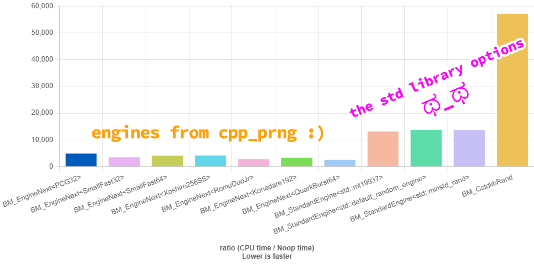
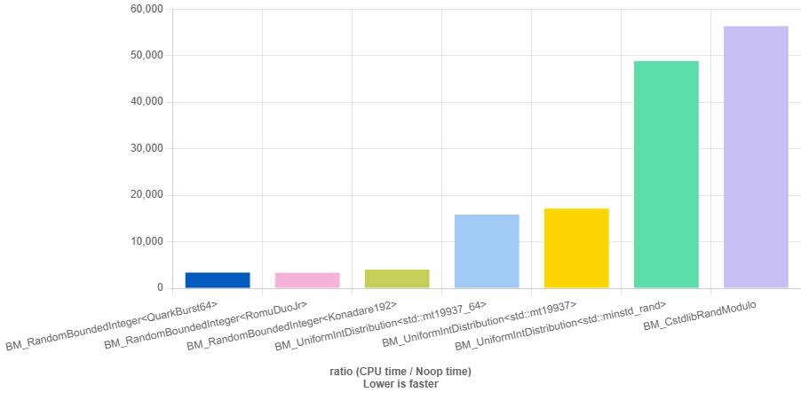
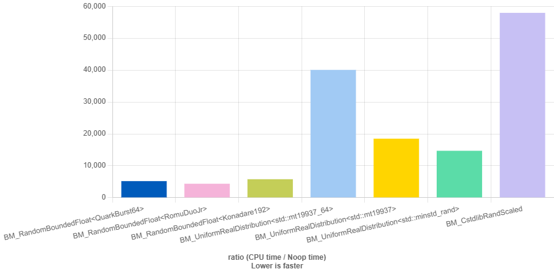

# cpp_prngs

[](https://github.com/ulfben/cpp_prngs/actions/workflows/build-and-test.yml)

When generating random numbers for games, the priorities are usually speed, reproducibility, portability, and convenience - not cryptographic security. The C and C++ standard facilities are often an awkward fit for those goals.

The classic C `srand()` / `rand()` interface is explicitly described by the C++ standard as a [low-quality, non-portable and a source of possible data races](https://eel.is/c++draft/rand#c.math.rand). It relies on hidden global state: `srand()` changes the sequence used by `rand()`, and any part of a program can call either function. This makes random behavior hard to isolate and reproduce. Its underlying algorithm is unspecified, so the same seed may produce different results on different platforms. `RAND_MAX` is permitted to be [as low as 32,767](https://web.archive.org/web/20260410163728/https://www.codingnest.com/generating-random-numbers-using-c-standard-library-the-problems/#fn1), and common attempts to turn its output into a useful range - such as `rand() % n` - [are slow](https://github.com/ulfben/cpp_prngs/#bounded-integers) and can introduce [modulo bias](https://web.archive.org/web/20260410163728/https://www.codingnest.com/generating-random-numbers-using-c-standard-library-the-problems/).

C++11 introduced `<random>`, which is much better, but it still has several practical drawbacks for game development:

* **Seeding the built-in engines correctly is notoriously difficult.** Supplying enough high-quality seed material is [easy to get wrong](https://www.pcg-random.org/posts/cpp-seeding-surprises.html), and awkward enough to have motivated multiple C++ committee proposals, including [P0205R1](https://www.open-std.org/jtc1/sc22/wg21/docs/papers/2021/p0205r1.html) and [P0347R1](https://www.open-std.org/jtc1/sc22/wg21/docs/papers/2016/p0347r1.html). For games, this makes it harder than it should be to create reliable deterministic runs, procedural worlds and replays.

* **Standard distributions are not portable across standard-library implementations.** Given the same engine state, distributions such as `std::normal_distribution` are not required to produce the same sequence of values on different platforms. That means a procedural level, simulation, or replay can diverge between Windows, Linux, consoles, or different compiler libraries even when the seed is identical. See [P2059R0: Make Pseudo-random Numbers Portable](https://www.open-std.org/jtc1/sc22/wg21/docs/papers/2020/p2059r0.pdf).

* **The standard random facilities cannot currently run at compile time.** Engines and distributions in `<random>` are not `constexpr`, so they cannot be used to generate lookup tables, test data, procedural content, or other random-derived values during compilation. Making the deterministic `<random>` facilities `constexpr` is still only proposed for C++29 in [P3791R1](https://www.open-std.org/jtc1/sc22/wg21/docs/papers/2026/p3791r1.html).

The most widely used general-purpose engine in the C++ standard library is probably the Mersenne Twister, [`std::mt19937`](https://eel.is/c++draft/rand.predef). It is a respectable generator, but it requires **624 state words - typically around 2.5 KiB of internal state**. All else being equal, a large state puts more pressure on CPU caches. Modern generators such as [xoshiro256**](https://prng.di.unimi.it/), [PCG](https://www.pcg-random.org/paper.html), and [Romu](https://www.romu-random.org/) require much less state and offer [significantly better performance](https://github.com/ulfben/cpp_prngs/#performance-benchmarks). The engines included here range from **4 bytes of state** for tiny microcontroller-oriented generators to 32 bytes for general-purpose 64-bit generators.

For a deep, game-focused comparison of 47 PRNGs across nine platforms, see Rhet Butler's excellent [RNG Battle Royale (2020)](https://web.archive.org/web/20220704174727/https://rhet.dev/wheel/rng-battle-royale-47-prngs-9-consoles/). It compares the performance, portability, state size, and statistical quality that matter in real-world game development. Several of its top-performing generators - including Romu and SmallFast - are included here.

So, if you want a random-number generator that is:

* compact (**4–32 bytes of state**) and [fast](https://github.com/ulfben/cpp_prngs#performance-benchmarks)
* deterministic across platforms (for equivalent integer and floating-point representations)
* [easy to seed](https://github.com/ulfben/cpp_prngs#seeding)
* [feature-rich](https://github.com/ulfben/cpp_prngs#random-api), with integers, floats, coin flips, weighted draws, random element selection, Gaussian samples, raw bits
* usable at compile time with `constexpr`
* [compatible](https://en.cppreference.com/w/cpp/named_req/UniformRandomBitGenerator) with STL algorithms and distributions such as `std::shuffle`, `std::sample`, and `std::*_distribution`

…go ahead and copy the complete `includes/` directory into your project, and go forth and prosper. Let me know if you find bugs or add any cool new features!

[Try it on Compiler Explorer!](https://compiler-explorer.com/z/PrjqfrP5z)

---

## Getting Started

cpp_prngs is header-only. Copy the complete `includes/` directory into your project, add it to your compiler's include path, and include [`random.hpp`](https://github.com/ulfben/cpp_prngs/blob/main/includes/random.hpp). The same C++17 implementation is used on desktop and classic AVR-based Arduino targets; a private compatibility layer selects standard-library facilities or small fallbacks according to what the toolchain provides.

### Desktop and full standard-library targets

Choose an engine and wrap it in `Random<E>`:

```cpp
#include "engines/romuduojr.hpp" // The engine; choose another from includes/engines if you prefer.
#include "random.hpp"            // The portable C++17 Random<E> frontend.

using rnd::Random;

Random<RomuDuoJr> rng{1234};      // A generator with a fixed seed.
int damage = rng.between(10, 20); // Random integer in [10, 20).
```

Use `Random<E>` to access [convenient utilities](https://github.com/ulfben/cpp_prngs#random-api) while keeping the engine easy to replace.

### Arduino AVR

On a classic AVR-based Arduino, include the same header and consider one of the small-output engines:

```cpp
#include "engines/small_fast16.hpp"
#include "random.hpp"

rnd::Random<SmallFast16> rng{1234};

const uint16_t blink_ms = rng.between(uint16_t{100}, uint16_t{500});
const bool turn_left = rng.coin_flip();
```

The Arduino AVR core defaults to C++11, so make sure to compile your sketch as C++17. See [Building for Arduino AVR](#building-for-arduino-avr) for a complete Arduino CLI command.

### Weighted draws

Pass a collection of weights to `weighted_index()` when the weights themselves form the lookup table. Each returned index corresponds to the weight at that index:

```cpp
#include <array>

constexpr std::array weights{50u, 30u, 15u, 5u};
const std::size_t tier = rng.weighted_index(weights);
// tier 0 is selected with weight 50, tier 1 with weight 30, and so on.
```

When weights are stored in a collection of objects, pass a projection to `weighted_element()` or `weighted_iterator()`. A pointer to the weight member is often all the projection you need:

```cpp
#include <array>
#include <string_view>

struct LootDrop{
    std::string_view name;
    unsigned weight;
};

constexpr std::array loot_table{
    LootDrop{"potion", 50u},
    LootDrop{"gold", 30u},
    LootDrop{"magic sword", 15u},
    LootDrop{"dragon egg", 5u}
};

const LootDrop& drop = rng.weighted_element(loot_table, &LootDrop::weight);
```

Weights should be non-negative whole numbers. A weight of 0 means the item will never be selected. At least one weight must be greater than zero.


[Try it on Compiler Explorer!](https://compiler-explorer.com/z/PrjqfrP5z)

---

## [Engines](https://github.com/ulfben/cpp_prngs/tree/main/includes/engines)

All included engines are header-only, C++17-compatible, usable during constant evaluation, and [very fast](https://github.com/ulfben/cpp_prngs#performance-benchmarks). Their state ranges from 4 to 32 bytes.

### General-purpose engines

These are the normal choices for desktop applications and other targets with efficient 32- or 64-bit arithmetic. Prefer a 64-bit-output engine on desktop unless you have a reason to choose otherwise.

| Engine | Output | State | Description |
|--------|-------:|------:|-------------|
| [`PCG32`](https://github.com/ulfben/cpp_prngs/blob/main/includes/engines/pcg32.hpp) | 32 bits | 16 bytes | C++ port of [Melissa O’Neill’s minimal PCG32](https://www.pcg-random.org/download.html#minimal-c-implementation). |
| [`SmallFast32`](https://github.com/ulfben/cpp_prngs/blob/main/includes/engines/small_fast32.hpp) | 32 bits | 16 bytes | C++ port of [Bob Jenkins’ 32-bit Small Fast](https://burtleburtle.net/bob/rand/smallprng.html) generator. |
| [`RomuDuoJr`](https://github.com/ulfben/cpp_prngs/blob/main/includes/engines/romuduojr.hpp) | 64 bits | 16 bytes | C++ port of [Mark Overton’s RomuDuoJr](https://romu-random.org/). Winner of Rhet Butler’s [RNG Battle Royale (2020)](https://web.archive.org/web/20220704174727/https://rhet.dev/wheel/rng-battle-royale-47-prngs-9-consoles/) and second fastest engine in the lineup! |
| [`QuarkBurst64`](https://github.com/ulfben/cpp_prngs/blob/main/includes/engines/quarkburst64.hpp) | 64 bits | 24 bytes | C++ port of [Eightomic’s quarkburst1x64](https://github.com/eightomic/quarkburst), previously published as [GhostScramble](https://web.archive.org/web/20260531035702/https://github.com/williamstaffordparsons/ghostscramble/blob/master/ghostscramble.c). The fastest engine in the current benchmarks. |
| [`Konadare192`](https://github.com/ulfben/cpp_prngs/blob/main/includes/engines/konadare192.hpp) | 64 bits | 24 bytes | C++ port of [Pelle Evensen's konadare192px++](https://github.com/pellevensen/PReenactiNG); the third-fastest 64-bit engine in the current benchmarks. |
| [`SmallFast64`](https://github.com/ulfben/cpp_prngs/blob/main/includes/engines/small_fast64.hpp) | 64 bits | 32 bytes | A 64-bit three-rotate [Small Fast](https://burtleburtle.net/bob/rand/smallprng.html) implementation, using rotates (7, 13, 37). |
| [`Xoshiro256SS`](https://github.com/ulfben/cpp_prngs/blob/main/includes/engines/xoshiro256ss.hpp) | 64 bits | 32 bytes | C++ port of David Blackman and Sebastiano Vigna's [xoshiro256\*\* 1.0](https://prng.di.unimi.it/) generator. |

### Small-output engines for microcontrollers

These engines return 8 or 16 bits at a time and use only 4–8 bytes of state. Their narrow arithmetic can be a better fit for small microcontrollers such as AVR-based Arduino boards.

| Engine | Output | State | Description |
|--------|-------:|------:|------------------------|
| [`SmallFast8`](https://github.com/ulfben/cpp_prngs/blob/main/includes/engines/small_fast8.hpp) | 8 bits | 4 bytes | The smallest Small Fast variant, when every byte of state matters. |
| [`XorShift32Star8`](https://github.com/ulfben/cpp_prngs/blob/main/includes/engines/xorshift32star8.hpp) | 8 bits | 4 bytes | A [tiny](https://excamera.com/sphinx/article-xorshift.html) [xorshift\* variant](https://arxiv.org/abs/1402.6246): Marsaglia's full-period 32-bit xorshift recurrence with Vigna-style multiplicative scrambling, returning the high 8 bits. |
| [`SmallFast16`](https://github.com/ulfben/cpp_prngs/blob/main/includes/engines/small_fast16.hpp) | 16 bits | 8 bytes | A useful middle ground when an 8-bit result is too restrictive; uses [O’Neill’s tested 16-bit constants](https://www.pcg-random.org/posts/bob-jenkins-small-prng-passes-practrand.html). |

An engine's output width limits bounds, collection sizes, and total weights used by `Random<E>`. An 8-bit engine accepts bounds up to 255, `SmallFast16` up to 65,535, and a 32-bit engine up to roughly 4.29 billion. Methods such as `bits_as<T>()` can combine several engine outputs when you need a wider raw value. Debug builds alert you when a requested range is too large.

Each included engine is a small, self-contained random number generator. You can use an engine directly, but it deliberately provides only the basics: seeding, advancing its state, comparing states, and generating random unsigned integers.

For everyday use, wrap an engine in `Random<E>`. It adds bounded numbers, floats, coin flips, random elements, weighted selection, Gaussian samples, and more while letting you swap the underlying engine without changing the rest of your code.

All included engines satisfy the C++20 [`RandomBitEngine`](https://github.com/ulfben/cpp_prngs/blob/main/includes/concepts.hpp) concept and are compatible with standard C++ facilities such as `std::shuffle` and `std::sample`. Since porting to C++17 the `Random<E>` implementation checks its essential engine assumptions with `static_assert` diagnostics instead of requiring concepts.

Want to use your own engine? It must provide the interface described by `RandomBitEngine`, use an 8-, 16-, 32-, or 64-bit unsigned `result_type`, and span that type from zero through its maximum value.

---

## Random API

[`random.hpp`](https://github.com/ulfben/cpp_prngs/blob/main/includes/random.hpp) exposes `rnd::Random<E>` on every supported target.

### Construction and engine state

| Method | Description |
|--------|-------------|
| `Random<E>()` | Default-constructs the engine `E` with its default seed |
| `Random<E>(seed)` | Constructs by seeding the engine with `seed` |
| `Random<E>(engine)` | Constructs by copying an existing engine instance |
| `operator==(other)` | Returns `true` if two generators have identical state |
| `engine()` / `engine() const` | Accesses the underlying engine instance for manual serialization, debugging, etc. |
| `seed()` | Reseeds the engine back to its default state |
| `seed(v)` | Reseeds the engine with value `v` |
| `discard(n)` | Advances the underlying engine by `n` steps |
| `split()` | Derives a child generator from the parent, useful for task- or thread-local generators when strict stream separation is not required |

### Raw values and bits

| Method | Description |
|--------|-------------|
| `min()` | Returns the engine’s minimum possible value, typically 0 |
| `max()` | Returns the engine’s maximum possible value |
| `next()` / `operator()()` | Returns the next random number in `[min(), max()]` |
| `bits(n)` | Returns `n` random bits in the low bits of `T` at runtime (`1 ≤ n ≤ digits(T)`), drawing from the high bits of one or more engine outputs; `T` defaults to `result_type`[^1] |
| `bits<N, T>()` | Returns `N` random bits in the low bits of `T`; constraints are checked at compile time[^1] |
| `bits_as<T>()` | Returns an unsigned `T` filled with high-quality random bits |
| `fill_bits<T>(buffer, count)` | Efficiently fills buffer with raw random T values, minimizing engine calls when T is narrower than the engine output |

### Integers

| Method | Description |
|--------|-------------|
| `next(bound)` / `operator()(bound)` | Returns an unbiased integer in `[0, bound)`, using [Lemire’s FastRange](https://lemire.me/blog/2016/06/27/a-fast-alternative-to-the-modulo-reduction/) with rejection when needed |
| `next<N, T>()` | Returns an integer in `[0, N)` with a compile-time bound and optional result type `T`; optimized for power-of-two bounds[^1] |
| `between(I lo, I hi)` | Returns an integer in `[lo, hi)` |

Bounded generation uses the multiply-high result for the common case and only
computes the rejection threshold when the low product half falls into the
candidate rejection region. This nearly-divisionless arrangement is explained
by [Tony Finch](https://dotat.at/@/2025-03-05-lemire-inline.html), including why
compile-time bounds can fold the threshold calculation away. The result remains
unbiased; the rejection step corrects the small floor/ceiling imbalance of raw
FastRange.

### Floating point

| Method | Description |
|--------|-------------|
| `normalized<F>()` | Returns a floating-point value in `[0.0, 1.0)` using the [IQ float hack](https://iquilezles.org/articles/sfrand/); `F` defaults to `float` |
| `signed_norm<F>()` | Returns a floating-point value in `[-1.0, 1.0)`; `F` defaults to `float` |
| `between(F lo, F hi)` | Returns a floating-point value in `[lo, hi)` |

### Probability and distributions

| Method | Description |
|--------|-------------|
| `coin_flip()` | Fair coin flip (`true` approximately 50% of the time) |
| `coin_flip(p)` | Weighted coin (`true` with probability `p`, where `p` is in `[0.0, 1.0]`) |
| `gaussian(mean, stddev)` | Returns an approximate normal sample via the Irwin–Hall sum-of-12 method |

### Collections

| Method | Description |
|--------|-------------|
| `index(collection)` | Returns a random index into a collection |
| `iterator(collection)` | Returns the collection's iterator to a random element |
| `element(collection)` | Returns a reference to a random element |

iterator(container) returns the container's native iterator. iterator(pointer, count) returns a pointer to the selected element, which serves as the iterator for a pointer-defined range.

### Weighted collections

| Method | Description |
|--------|-------------|
| `weighted_index(weights)` | Returns an index selected proportionally to unsigned weights; zero-weight indices are excluded |
| `weighted_iterator(collection, projection)` | Returns the collection's iterator selected proportionally to weights returned by `projection(element)` |
| `weighted_element(collection, projection)` | Returns a reference selected proportionally to weights returned by `projection(element)` |

The weighted helpers let you pick items with different chances of being selected. Weights should be non-negative whole numbers, such as `{70u, 25u, 5u}`. A weight of 0 means the item will never be selected. At least one weight must be greater than zero.

### Portability and floating-point details

`random.hpp` uses standard type traits, collection access helpers, and constexpr `std::bit_cast` when the toolchain provides them. Its private compatibility layer also provides a narrow constexpr projection helper for callables, member functions, and data members. On AVR-libc, the layer supplies small fallbacks for the unavailable standard-library facilities.

In C++20 and later, normalized floating-point generation uses constexpr `std::bit_cast`. In C++17 it uses a constexpr arithmetic implementation by default. If you don't need constexpr execution you can define `RND_FAST_FLOAT` to select a runtime `memcpy` bit cast instead; only the floating-point methods lose constexpr evaluation in that mode.

Methods are templates or inline functions, so unused features do not add code to the final program.

[^1]: Although `bits(n)` and `bits<N>()` *can* be used for power-of-two integer ranges, this is not their intended purpose. Prefer `next<N,T>()` instead. It chooses the same fast, unbiased bit-shift specialization, but makes your code clearer and safer.

---

## Performance Benchmarks

The [benchmark suite](benchmarks/) uses [Quick Bench](https://quick-bench.com/) to measure three representative workloads:

- [Raw engine throughput](https://quick-bench.com/q/L2igH6P-IVdiwrTdVpuEzkzoH5Q) using `next()`.
- [Bounded integer generation](https://quick-bench.com/q/6hjHn7fpVdaEmp37BcsXyW4A3K4) using `Random<E>::next(bound)`.
- [Bounded floating-point generation](https://quick-bench.com/q/GP9Zfw7YOaXteDOztQ_P2kYnmoY) using `Random<E>::between(lo, hi)`.

The bounded benchmarks exercise the public `Random<E>` interface and compare it with equivalent C and C++ standard-library approaches. Lower bars are faster.

### Engine throughput

Generating raw random numbers using `next()`:



All of the included engines substantially outperform the standard-library generators in this benchmark.

### Bounded integers

Generating random integers in `[0, bound)` using `Random<E>::next(bound)`:



### Bounded floating-point values

Generating random floats in `[lo, hi)` using `Random<E>::between(lo, hi)`:




The bounded benchmarks show that the convenience provided by `Random<E>` does not come at the expense of performance. QuarkBurst64, RomuDuoJr, and Konadare192 are currently the fastest engines in these comparisons.

Performance depends on the compiler, standard library, build settings, CPU, and workload. Always benchmark on your own target hardware before choosing an engine.

---

## Seeding 

All engines in this library are seeded from a single `uint64_t` value. They provide a fixed default seed, so default construction (`Random<E>()`) is always valid - but produces the *same* sequence every time.

To get varied sequences, you’ll want to provide a high-entropy seed. `std::random_device` is often used for this - it's typically backed by an operating-system entropy source and [works fine on most platforms](https://codingnest.com/generating-random-numbers-using-c-standard-library-the-problems/). But it can be slow, unavailable (e.g. on embedded systems, or at compile time), and is unsuitable when you need determinism.

In game development, determinism is often useful - for example in procedural generation, tests, or replays. In these cases, consistent seeds let you reproduce the same output across runs and platforms.

An optional standalone [`seeding.hpp`](https://gist.github.com/ulfben/76518f306880bb7a014e35832c555cf6) is available separately from this repository. It is a collection of example seeding techniques for runtime and compile-time contexts, using sources such as timestamps, thread IDs, game assets, player data, and compilation metadata.

```cpp
#include "seeding.hpp" // Download from the linked gist

//Example usage:
using rnd::Random; 

// Compile-time seeding:
constexpr auto seed1 = seed::from_text("my_game_seed");
constexpr auto seed2 = seed::from_source();           // Different for each compilation unit (source file)
constexpr auto seed3 = SEED_UNIQUE_FROM_SOURCE();     // Different for each macro expansion, even within the same source file

// Runtime seeding:
Random<SmallFast32> rng1(seed::from_time());		  // High resolution clock
Random<SmallFast64> rng2(seed::from_system_entropy());// Uses std::random_device (hardware/system entropy)

// Sources of run-to-run variation:
Random<RomuDuoJr> rng3(seed::from_thread());          // Unique per thread
Random<PCG32>     rng4(seed::from_stack());			  // Varies per run of the application, if ASLR is active
Random<PCG32>     rng5(seed::from_cpu_time());		  // Varies with CPU time consumed by the process; can reflect workload or scheduling

// Combine all available sources:
Random<Xoshiro256SS> rng6(seed::from_all());          // Combines all sources (time, thread, stack, heap, compile time, source data, hw entropy, etc.)
```

These utilities help you seed your random number generators appropriately - whether you need compile-time evaluation, reproducibility, run-to-run variation, or unpredictability.

---

## Building and testing

### CMake

The CMake build requires CMake 3.21 or newer. The repository provides a header-only target named `cpp_prngs::cpp_prngs`. When using cpp_prngs as a subdirectory, link that target to inherit its include path and C++17 requirement:

```cmake
add_subdirectory(path/to/cpp_prngs)
target_link_libraries(your_target PRIVATE cpp_prngs::cpp_prngs)
```

To configure, build, and run the test suite directly:

```sh
cmake -S . -B build -DCPP_PRNGS_BUILD_TESTS=ON -DCMAKE_BUILD_TYPE=Release
cmake --build build --config Release
ctest --test-dir build -C Release --output-on-failure
```

The test build downloads the pinned GoogleTest dependency automatically. A shared development preset is also available:

```sh
cmake --preset dev
cmake --build --preset dev
ctest --preset dev
```

The test suite also builds the engines and both `random.hpp` floating-point modes as C++17 targets.

### Building for Arduino AVR

The Arduino AVR core defaults to C++11, while the engines and `random.hpp` require C++17. The repository's CI validates an ATmega32U4 target with Arduino AVR core 1.8.8.

#### Arduino CLI
You can compile a sketch with C++17 through Arduino CLI:

```sh
arduino-cli core update-index
arduino-cli core install arduino:avr@1.8.8
arduino-cli compile \
  --fqbn arduino:avr:leonardo \
  --warnings all \
  --build-property "compiler.cpp.extra_flags=-std=gnu++17 -I/path/to/cpp_prngs/includes" \
  /path/to/your/sketch
```

Replace `/path/to/cpp_prngs/includes` with the repository's `includes` directory and `/path/to/your/sketch` with your sketch directory. To enable the optional runtime-optimized floating-point path, add `-DRND_FAST_FLOAT` to `compiler.cpp.extra_flags`. CI compiles both modes.

#### Arduino IDE 2 on Windows
With Arduino IDE 2 on Windows, locate the installed AVR core under:

```text
C:\Users\<username>\AppData\Local\Arduino15\packages\arduino\hardware\avr\<version>\
```

Create a `platform.local.txt` file next to `platform.txt` containing:

```text
compiler.cpp.extra_flags=-std=gnu++17
```

Then restart the Arduino IDE.

---

## License

This repository is primarily licensed under the MIT License. See [LICENSE](https://github.com/ulfben/cpp_prngs/blob/main/LICENSE.md) for full details.

### Attributions and Third-Party Code

This project includes, or is based on, the following PRNG engines and reference implementations:

- **QuarkBurst64**: Independent C++ implementation under MIT of William Stafford Parsons’ quarkburst1x64, created for [Eightomic](https://github.com/eightomic/quarkburst) and released under [BSD-3-Clause](https://github.com/eightomic/quarkburst/commit/2f754cf4e18e6ecdfec17c2bda72a1a1aa531db5). Previously published as [GhostScramble](https://web.archive.org/web/20260531035702/https://github.com/williamstaffordparsons/ghostscramble/blob/master/ghostscramble.c).
- **RomuDuoJr**: Based on Rhet Butler’s C++ wrapper ([public domain](https://github.com/Almightygir/rhet_RNG/blob/main/xromu2jr.h)), itself inspired by Mark Overton’s [Romu family](https://romu-random.org/).
- **SmallFast8 / SmallFast16**: Based on Bob Jenkins’ algorithm and M.E. O’Neill’s narrow-width constants and reference implementation ([MIT License](https://gist.github.com/imneme/85cff47d4bad8de6bdeb671f9c76c814)); see her excellent [PractRand analysis](https://www.pcg-random.org/posts/bob-jenkins-small-prng-passes-practrand.html).
- **SmallFast32 / SmallFast64**: Based on Bob Jenkins’ reference implementation ([public domain](https://burtleburtle.net/bob/rand/smallprng.html)).
- **XorShift32Star8**: XorShift transition by [George Marsaglia](https://doi.org/10.18637/jss.v008.i14), XorShift\* scrambler by [Sebastiano Vigna](https://arxiv.org/abs/1402.6246), and truncated parameterization and implementation by [M.E. O’Neill](https://gist.github.com/imneme/9b769cefccac1f2bd728596da3a856dd) ([MIT License](https://gist.github.com/imneme/9b769cefccac1f2bd728596da3a856dd)).
- **xoshiro256\*\***: Based on David Blackman & Sebastiano Vigna’s reference code ([public domain](https://prng.di.unimi.it/xoshiro256starstar.c)).
- **splitmix64**: By Sebastiano Vigna ([public domain](https://prng.di.unimi.it/splitmix64.c)).
- **PCG32**: Based on M.E. O’Neill’s reference implementation ([Apache License 2.0](https://github.com/imneme/pcg-c-basic/)).
- **konadare192px++**: By Pelle Evensen ([Apache License 2.0](https://github.com/pellevensen/PReenactiNG)).

Where applicable, copyright and license information is included in the header of each source file.

All additional code, wrappers, and modifications © Ulf Benjaminsson, licensed under the MIT License unless otherwise noted.
